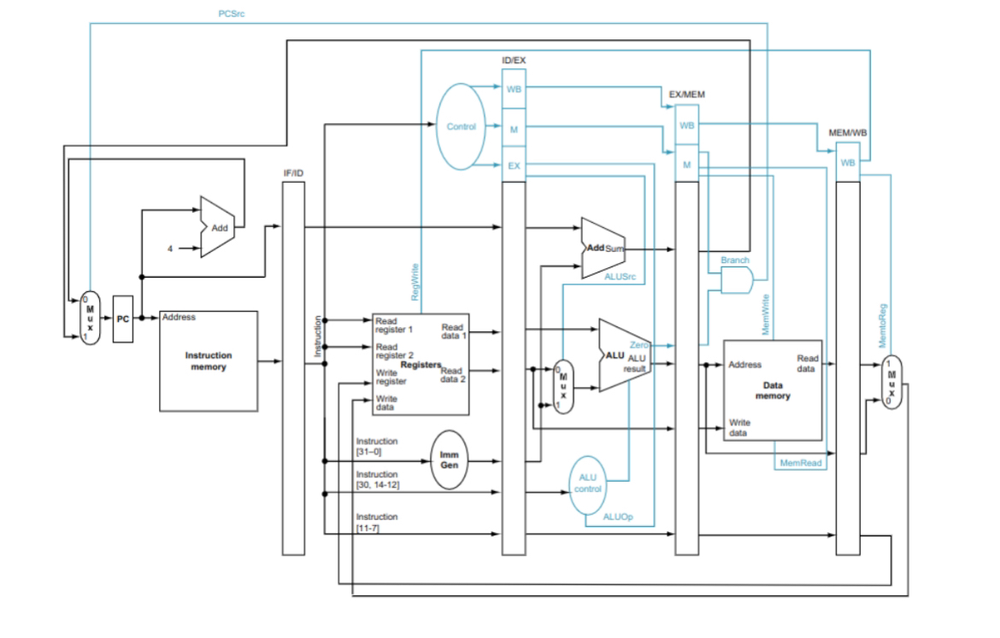

# RISC-V CPU Simulator

#### Demonstrational video found [here](https://www.youtube.com/watch?v=dQw4w9WgXcQ)

## Features
- Highly customizable cache (Aspects such as hit latency, associativity, and number of sets & blocks)
- Option to use LFU or LRU replacement method
- Selection between single or dual-issue instruction pipeline
- Able to print out various execution statistics such as cache performance
- Has hazard detection and resolving
- Based on the digital logic circuit design below

  
  

## How does it work?
### Given we are using a single-issue pipeline, cache size of 4096 Bytes, and LRU replacement method:
- First takes a given text file with 32-bit hexadecimal numbers as input
- Converts the bits to instructions based on the [RISC-V Instruction](riscv-card.pdf) set
- Runs each instruction through a 5-stage single-issue pipeline
- Instructions flow through each stage in the following order:
  Instruction Fetch -> Instruction Decode -> Execute -> Memory -> Writeback
- Each clock cycle will send an instruction through this pipeline
- During each of these stages, the instruction will be manipulated so that its respective registers are changed accordingly
- Upon completion, a summary of the process will be shown
- The summary can be set to display register traces/stats or cache traces/stats

## Future Plans
### I intend to continuously add to this project and make improvements. A short list of things I want to implement in the future are:
- Full customizability through a menu that is user-friendly (Kind of like a GUI)
- Hazard detection and resolving for the dual-issue pipeline
- General cleaning up of code and adding more comments/descriptive comments for easier understanding
